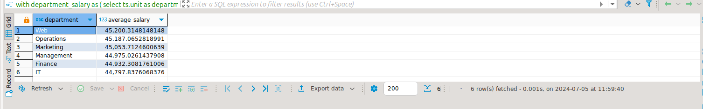

# PSQL Assignment 4

### Common Table Expressions (CTEs):

#### Question: 1  Calculate the average salary by department for all Analysts.
```
with
	department_salary as ---returns departments and salaries
	(
		select
			ts.unit as department,
			ts.salary as salary
		from
			table_salary ts
	)
select
	ds.department,
	avg(ds.salary) as Average_Salary
from
	department_salary as ds
group by
	ds.department;
```
##### Output:


#### Question 2: List all employees who have used more than 10 leaves.
```
with
	employee_leave as (
		select
			ts.first_name,
			ts.last_name,
			ts.leave_used
		from
			table_salary ts
	)
select
	*
from
	employee_leave
where
	employee_leave.leave_used > 10;
```
##### Output:


### View:

#### Question 3: Create a view to show the details of all Senior Analysts.
##### Creating View:
```
create view
	senior_Analyst_view as
select
	*
from
	table_salary ts
where
	ts.designation = 'Senior Analyst';
```
##### Reading From View
```
select
	*
from
	senior_Analyst_view;
```
##### Output:


### Materialised View:
#### Question 4: Create a materialized view to store the count of employees by department.
##### Creating View:
```
create materialized view emloyees_count_per_department as
select
	ts.unit as Department,
	count(ts.first_name) as employee_count
from
	table_salary ts
group by
	ts.unit;

```
##### Reading From View
```
select
	*
from
	day4assignment.emloyees_count_per_department;
```
##### Output:


### Procedures (Stored Procedures):
#### Question 6: Create a procedure to update an employee's salary by their first name and last name.
##### Creating Procedure:
```
create or replace procedure update_salary(
	selected_first_name varchar(50),
	selected_last_name varchar(50),
	updated_salary int
)
language plpgsql
as $$
begin 
	update table_salary 
	set salary=updated_salary
	where first_name=selected_first_name
	and last_name=selected_last_name;
	commit;
end;$$;

```
##### Before Updating
```
select
	ts.first_name,ts.last_name,ts.salary 
from 
	table_salary ts 
where
	ts.first_name ='TOMASA'
and
	ts.last_name ='ARMEN';
```
##### Output: 


##### Calling Update Function
```
call update_salary('TOMASA','ARMEN',50000);
```
##### After Updating
```
select
	ts.first_name,ts.last_name,ts.salary 
from 
	table_salary ts 
where
	ts.first_name ='TOMASA'
and
	ts.last_name ='ARMEN';
```
##### Output:


#### Question 7: Create a procedure to calculate the total number of leaves used across all departments.
##### Creating Procedure:
```
create or replace procedure calculate_leaves_across_department()
language plpgsql
as $$
begin 
	drop materialized view if exists leaves_across_department;
	create materialized view leaves_across_department as
	select  unit as department, sum(leave_used) as Total_leave_used_across_department
	from table_salary
	group by unit;
end;$$;

```
##### Procedure calculate_leaves_across_department()
```
call calculate_leaves_across_department();
```
##### Reading data
```
select * from leaves_across_department ;
```
##### Output:


